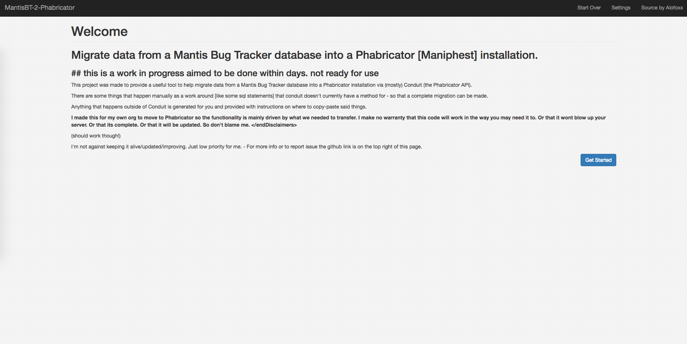
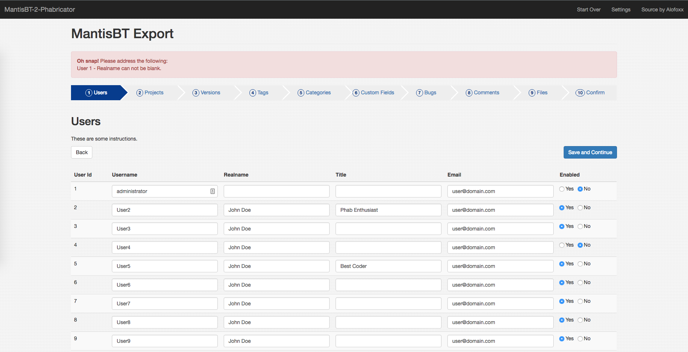
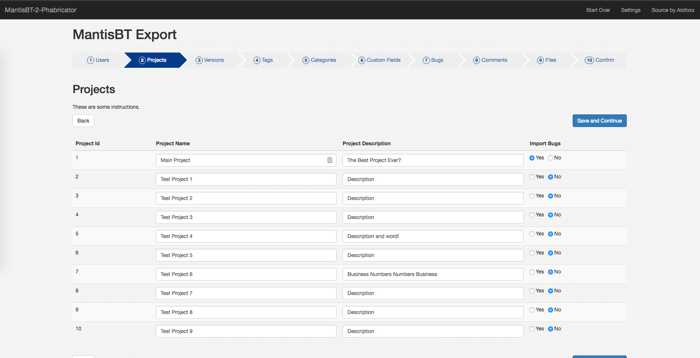
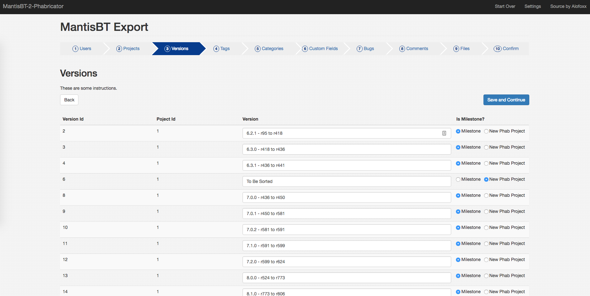
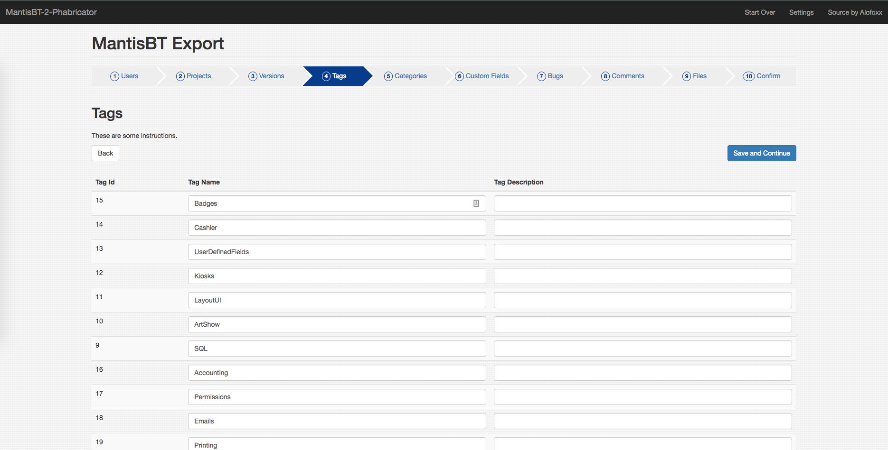
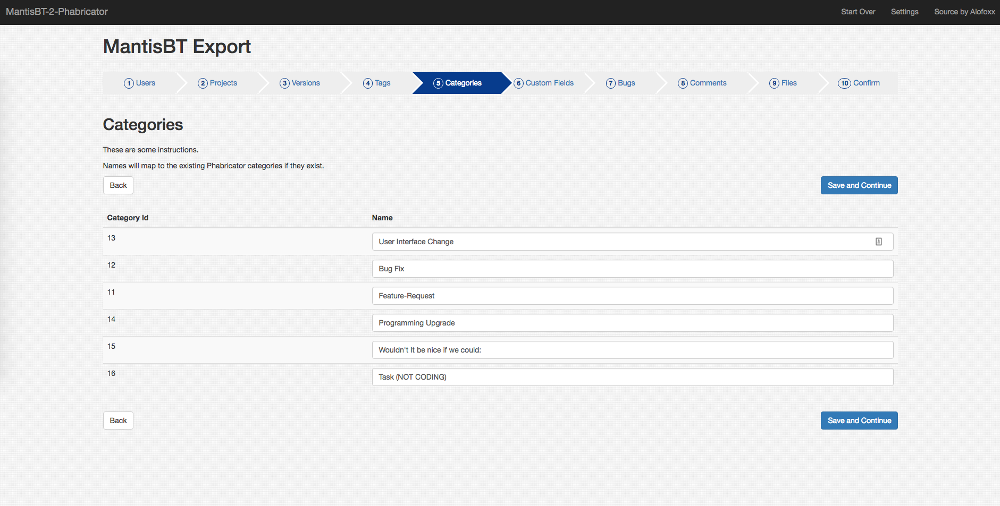

# MantisBT-2-Phabricator
Migrate data from a Mantis Bug Tracker database into a Phabricator [Maniphest] installation.

## this is a work in progress aimed to be done within days. not ready for use

This project was made to provide a useful tool to help migrate data from a Mantis Bug Tracker database into a Phabricator installation via (mostly) Conduit (the Phabricator API).
There are some things that happen manually as a work around [like some sql statements] that conduit doesn't currently have a method for - so that a complete migration can be made.
Anything that happens outside of Conduit is generated for you and provided with instructions on where to copy-paste said things.

I made this for my own org to move to Phabricator so the functionality is mainly driven by what we needed to transfer. I make no warranty that this code will work in the way you may need it to. Or that it wont blow up your server. Or that its complete. Or that it will be updated. So don't blame me. </endDisclaimers>

(should work though!)

I'm not against keeping it alive/updated/improving. Just low priority for me.

Here are some screen shots..

